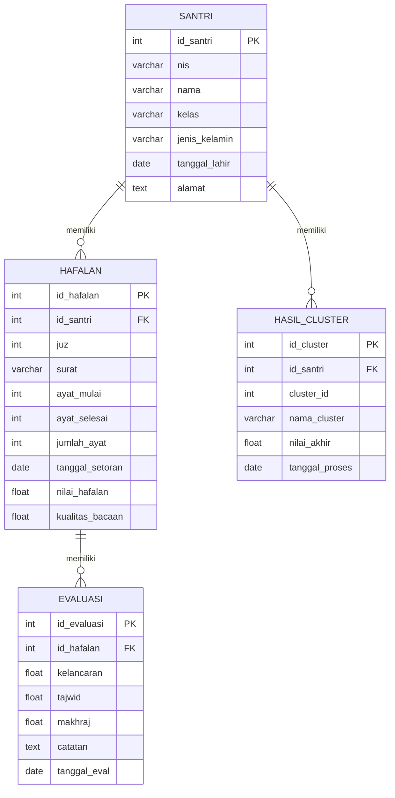

# Entity Relationship Diagram (ERD)
# Sistem Klasterisasi Hafalan Santri


## Deskripsi Sistem

Entity Relationship Diagram (ERD) ini menggambarkan rancangan struktur basis data pada Sistem Klasterisasi Hafalan Santri.

Database digunakan untuk menyimpan data santri, data hafalan, data evaluasi hafalan, dan hasil proses klasterisasi kemampuan hafalan santri.

Sistem ini mendukung proses pengelolaan data hafalan serta analisis pengelompokan kemampuan santri berdasarkan data hafalan.


# Entity Relationship Diagram





# Struktur Tabel Database


## Tabel SANTRI

Tabel SANTRI menyimpan data identitas santri yang mengikuti program hafalan.


| Field | Type | Constraint | Keterangan |
|---|---|---|---|
| id_santri | Integer | Primary Key | Identitas unik santri |
| nis | Varchar(20) | Unique | Nomor induk santri |
| nama | Varchar(100) | Not Null | Nama lengkap santri |
| kelas | Varchar(50) | Not Null | Kelas santri |
| jenis_kelamin | Enum | Not Null | Jenis kelamin |
| tanggal_lahir | Date | Nullable | Tanggal lahir |
| alamat | Text | Nullable | Alamat santri |


Relasi:

SANTRI memiliki banyak data HAFALAN.

```
SANTRI (1) -------- (N) HAFALAN
```


## Tabel HAFALAN

Tabel HAFALAN menyimpan data perkembangan hafalan santri berdasarkan kegiatan setoran.


| Field | Type | Constraint | Keterangan |
|---|---|---|---|
| id_hafalan | Integer | Primary Key | Identitas hafalan |
| id_santri | Integer | Foreign Key | Relasi ke tabel santri |
| juz | Integer | Not Null | Nomor juz |
| surat | Varchar(100) | Not Null | Nama surat |
| ayat_mulai | Integer | Not Null | Ayat awal |
| ayat_selesai | Integer | Not Null | Ayat akhir |
| jumlah_ayat | Integer | Not Null | Jumlah ayat |
| tanggal_setoran | Date | Not Null | Tanggal setoran |
| nilai_hafalan | Float | Not Null | Nilai hafalan |
| kualitas_bacaan | Float | Not Null | Kualitas bacaan |


Relasi:

```
HAFALAN (1) -------- (N) EVALUASI
```


## Tabel EVALUASI

Tabel EVALUASI menyimpan hasil penilaian kualitas hafalan oleh pembimbing.


| Field | Type | Constraint | Keterangan |
|---|---|---|---|
| id_evaluasi | Integer | Primary Key | Identitas evaluasi |
| id_hafalan | Integer | Foreign Key | Relasi ke tabel hafalan |
| kelancaran | Float | Not Null | Nilai kelancaran |
| tajwid | Float | Not Null | Nilai tajwid |
| makhraj | Float | Not Null | Nilai makhraj |
| catatan | Text | Nullable | Catatan evaluator |
| tanggal_eval | Date | Not Null | Tanggal evaluasi |


Relasi:

```
EVALUASI berhubungan dengan HAFALAN
```


## Tabel HASIL_CLUSTER

Tabel HASIL_CLUSTER menyimpan hasil pengelompokan kemampuan hafalan santri berdasarkan proses clustering.


| Field | Type | Constraint | Keterangan |
|---|---|---|---|
| id_cluster | Integer | Primary Key | Identitas hasil cluster |
| id_santri | Integer | Foreign Key | Relasi ke tabel santri |
| cluster_id | Integer | Not Null | Nomor cluster |
| nama_cluster | Varchar(50) | Not Null | Label kelompok |
| nilai_akhir | Float | Not Null | Nilai hasil clustering |
| tanggal_proses | Date | Not Null | Waktu proses clustering |


Relasi:

```
SANTRI (1) -------- (N) HASIL_CLUSTER
```


# Hubungan Antar Entity


```
+----------------------+
|        SANTRI        |
+----------------------+
          |
          |
          | 1 : N
          |
          v
+----------------------+
|       HAFALAN        |
+----------------------+
          |
          |
          | 1 : N
          |
          v
+----------------------+
|      EVALUASI        |
+----------------------+


+----------------------+
|        SANTRI        |
+----------------------+
          |
          |
          | 1 : N
          |
          v
+----------------------+
|    HASIL_CLUSTER     |
+----------------------+
```


# Aturan Integritas Data


Primary Key digunakan untuk memberikan identitas unik pada setiap data.


Foreign Key digunakan untuk menjaga hubungan antar tabel.


```
HAFALAN.id_santri
        |
        v
SANTRI.id_santri


EVALUASI.id_hafalan
        |
        v
HAFALAN.id_hafalan


HASIL_CLUSTER.id_santri
        |
        v
SANTRI.id_santri
```


Data hafalan tidak dapat dibuat apabila data santri belum tersedia.

Data evaluasi tidak dapat dibuat apabila data hafalan belum tersedia.

Data hasil clustering hanya dapat dibuat berdasarkan data santri yang memiliki data hafalan.


# Implementasi Sistem


Database ini menjadi dasar implementasi REST API pada Sistem Klasterisasi Hafalan Santri.

Data yang digunakan dalam proses clustering berasal dari jumlah hafalan, nilai hafalan, kualitas bacaan, dan hasil evaluasi.

Hasil clustering digunakan untuk mengelompokkan kemampuan hafalan santri sehingga dapat membantu proses monitoring dan pembinaan.


# Kesimpulan


ERD Sistem Klasterisasi Hafalan Santri terdiri dari empat tabel utama yaitu SANTRI, HAFALAN, EVALUASI, dan HASIL_CLUSTER.

Rancangan database ini mendukung penyimpanan data hafalan secara terstruktur serta mendukung proses analisis clustering secara terintegrasi.